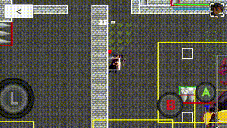
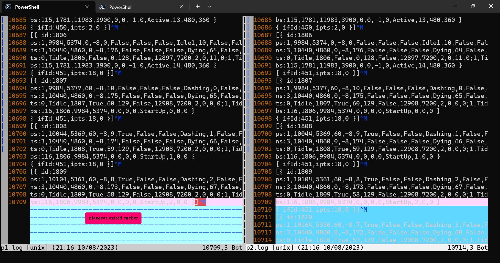
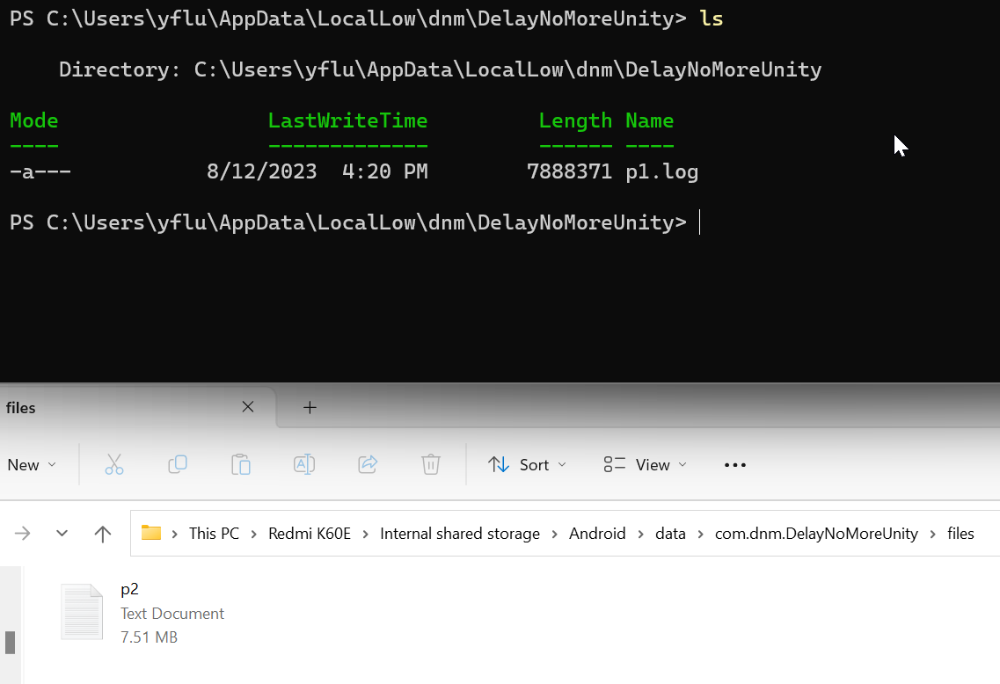
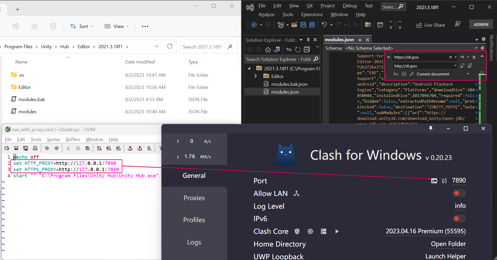

# Logging performance concern
`String.Format(...)` can be a serious performance issue when used too frequently. Please remove/comment them when you notice a lag or CPU spike possibly coupled with an intense logging period (it's always recommended to profile beforehand for proof).

# Is it possible to remove all "forceConfirmation"s if player input overwriting is unwanted?  
Yes it's possible to remove/disable both "type#1" and "type#3" in `backend/Battle/Room.cs`. However, it's highly recommended that you reserve the backend dynamics and downsync the RoomDownsyncFrame calculated by backend to all frontends periodically -- the frontend `AbstractMapController.onRoomDownsyncFrame` can handle correction of historic render frames without issue.

The root cause of the need for such periodic RoomDownsyncFrame downsync is that the physics engine uses floating point numbers, and I'm not a fan of determinisitc floating point approach (i.e. there're tradeoffs). If this project is an old style fighting game, then I can rewrite its physics to use rectilinear rectangles only, thus integer only (including snapping) -- yet I want slopes and rotations in the game :)

# How to find all spots of input predictions?
```
proj-root> grep -ri "31UL" --color ./frontend/Assets/Scripts/
proj-root> grep -ri "31UL" --color ./backend/
proj-root> grep -ri "31UL" --color ./shared/
```

# Latest tag change notes
v1.6.5 new features
- Improved frontend lockstep handling.
- Improved backend downsync nonblocking handling.
- Added use of `chaserRenderFrameIdLowerBound`.
- Added `potential graphical inconsistency indicators` on `NetworkDoctorInfo` panel.
- Enhanced jump holding mechanics for easier netcode prediction.
- Applied jump startup for slipping and air-jump, such that `input delay = 2 frames i.e. ~32ms` has fast graphical response (i.e. startup animation) but slow collision system response (i.e. after startup frames).
- Improved damaged-anim handling.
- Added support for `localExtraInputDelayFrames`.
    - Rule of thumb: the same `renderFrameId` MUST take the same `inputFrameId` for all peers regardless of their individual `inputDelay`s. 
    - Therefore, if individual `inputDelay`s are different, the trick would be on `inputFrameId` generation, i.e. for each peer if its `inputDelay` suddenly goes up from `inputDelayStd=2` to `inputDelayDynamic=4`, then its generated `inputFrameId` at `renderFrameId=242` should go up from `toGenerateInputFrameIdOld = (renderFrameId >> 2) = 60` to `toGenerateInputFrameIdNew = ((renderFrameId+(inputDelayDynamic-inputDelayStd)) >> 2)=61` -- while `localRequiredInputFrameId = ((renderFrameId-inputDelayStd) >> 2)` is unchanged, hence `toGenerateInputFrameIdNew` is to be used by a later renderFrame, making a feel of "larger input-to-impact-delay". 
- Added support for "no player input overwriting" on backend and option for "useFreezingLockStep" on frontend.

v1.5.9 new features
- Updated existing levels and characters.
- Tuned assets for DemonFireSlime.
- Fixed fireball Y-axis inertia.
- Accounted UDP upsyncs into `Room.inputBuffer` on `backend`.
- Enhanced `backend` handling of `inputBufferSnapshot` serialization on both thread-safety and efficiency.
- Fixed pickable stuck at upper platform.
- Enhanced handling of halted ws session.

v1.4.3 new features
- Replaced MonkGirl by new character WitchGirl
- Added new bullet type GroundWave
- Added bullet immune memory mechanism for enhanced "RemainsUponHit" behaviour
- Fixes for rdf history correction

v1.3.8 new features
- Added quota limited air-jump and air-dash dynamics
- Fixes for NPC jumping.
- Fixes for force-resync
- Fixes for a few `cancel-and-rejoin` cases in online arena
- Refactored UI for better login flow and inventory-btnB feature 
- Added new NPC character SkeleArcher 
- Added offline mode evt-triggered dialogs
- Added hold-to-jump-further dynamics
- Enhanced inertia handling for walking and jumping
- Prioritized dashing
- Reduced jumpng latency

v1.2.9 new features
- Fixed ringbuff contamination for pushback framelogging 
- Fixed resync continuation handling on the ACTIVE NORMAL TICKER side
- wave-based triggers (implemented by event mask subscription, configured in Tiled `EvtSub` object layer)
- character specific inventory & buff (including xform for knifegirl, and bomb for gungirl with different inventory types)
- backend dynamics (thus recovery reconnection & active slow ticker force resync) 
- more rigorous deterministic game dynamics

Please checkout the demo video on YouTube([basic ops](https://www.youtube.com/watch?v=gu_MfR2oWw0), [field tests](https://www.youtube.com/watch?v=le-gEMUMysM)) or BaiduNetDisk([basic ops](https://pan.baidu.com/s/1WPXsaxrkcQvZaQV0Kd75rg?pwd=vtzg), [field tests](https://pan.baidu.com/s/1WVDlJ1u40qctMFcdYuCw9g?pwd=nxa9)) (network setup was _4g Android v.s. Wifi PC via internet while UDP peer-to-peer holepunch failed, input delay = 2 frames i.e. ~32ms_).

# What's this project?
It's a Unity version of [DelayNoMore](https://github.com/genxium/DelayNoMore), a Multiplayer Platformer game demo on websocket with delayed-input Rollback Netcode inspired by GGPO -- but with the backend also rebuilt in C#.

_(battle between 4g Android v.s. Wifi Android via internet while UDP peer-to-peer holepunch failed, input delay = 2 frames i.e. ~32ms, the following GIF is converted from [this video](https://pan.baidu.com/s/1-VymVEIIFZ0W_9Uw5518Lw?pwd=l58c), please also checkout [these older version videos](https://pan.baidu.com/s/1Egq_vI7C9ANgiHO3vBGxcA?pwd=2m87), [this dedicated slope dynamics video](https://pan.baidu.com/s/1ANH2nlcT09mHFJcuvDPZlA?pwd=ycuk) and [this dedicated multi-enemy-head-walk video](https://pan.baidu.com/s/1A1u3d4G943FLmdOFAblTJw?pwd=gez7))_



_(demo for freezer buff since v1.2.7, [original video here](https://pan.baidu.com/s/183s9_xt4gmlTXsdIOQCyDw?pwd=ayr6))_


# Notable Features (by far, would add more in the future)
- Automatic correction for "slow ticker", especially "active slow ticker" which is well-known to be a headache for input synchronization
- Peer-to-peer UDP holepunching whenever possible, and will fallback to use the backend as a UDP relay/tunnel if holepunching failed for any participant (kindly note that UDP is always used along side with WebSocket, where the latter is a golden source of frame info)
- Rollback compatible NPC patrolling and vision reaction
- Rollback compatible static and dynamic traps, including a WYSIWYG notation support in Tiled editor (since v1.1.4)
- Rollback compatible monodirectional platform which also supports _slip-down_ operation
- Simple slope dynamics
- Standing and walking on multiple enemy-heads

_(a typical framelog comparison from 2 peers)_



_(where to find framelog files)_



# How does it work to synchronize across multiple players?
_(how input delay roughly works)_


_(how rollback-and-chase in this project roughly works)_


_(though using C# for both backend & frontend now, the idea to avoid floating err remains the same as shown below)_


# 1. Building & running

## 1.1 Tools to install 
### Backend
- [.NET Framework 7.0](https://dotnet.microsoft.com/en-us/download/dotnet/7.0)
```bash
proj-root/backend> dotnet run
```

### Frontend
- [Unity 2021.3](https://unity.com/releases/editor/qa/lts-releases)

Open `OfflineScene` to try out basic operations.

Open `LoginScene` after launching the backend to try out multiplayer mode. Available test accounts are listed in [DevEnvResources.sqlite](./backend/DevEnvResources.sqlite). The steps are very similar to [that of DelayNoMore CocosCreator version](https://github.com/genxium/DelayNoMore#frontend-2).

### Unit test
Referencing [this document from Microsoft](https://learn.microsoft.com/en-us/dotnet/core/testing/unit-testing-with-dotnet-test) by far.

# 2. Thanks
- To [dravenx](https://opengameart.org/users/dravenx) for providing the [spikey-stuff](https://opengameart.org/content/spikey-stuff).

# 3. Changing endpoints of UnityHub download and changing its http(s) proxy
Kindly note that the proxy setting is not very helpful here when download is slow (alternatively, sometimes the download is just timed out due to DNS issue, you might also wanna have a try on changing DNS only), changing the endpoints from `https` to `http` is critical.



References
- https://docs.unity3d.com/2022.1/Documentation/Manual/upm-config-network.html#Hub

# 4. How to properly measure input-prediction performance in a reproducible manner?
It's always non-trivial to mock fluctuating network behaviours, and in this game we might be interested in testing the performance of different input-prediction algorithms, therefore we'd like to mock DETERMINISTIC inputs for a single player including
- `a)` the initial map setup (from tmx), and 
- `b)` the initial character choices of all players, and
- `c)` received `RoomDownsyncFrame`s, `InputDownsyncFrame`s (from websocket) and `InputUpsyncFrame`s (from UDP peers) at EXACTLY THE SAME TIMINGS for different runs of different algorithms in test.

The first two, i.e. `a)` & `b)` are easy to mock and `c)` is possible by mocking [OnlineMapController.pollAndHandleWsRecvBuffer](https://github.com/genxium/DelayNoMoreUnity/blob/v1.2.2/frontend/Assets/Scripts/OnlineMapController.cs#L225) and [OnlineMapController.pollAndHandleUdpRecvBuffer](https://github.com/genxium/DelayNoMoreUnity/blob/v1.2.2/frontend/Assets/Scripts/OnlineMapController.cs#L226).

I should've provided an example of this type of test for the alleged good performance of my algorithm, especially for
- [UpdateInputFrameInPlaceUponDynamics](https://github.com/genxium/DelayNoMoreUnity/blob/v1.2.2/frontend/Assets/Scripts/Abstract/AbstractMapController.cs#L268), and  
- [processInertiaWalking](https://github.com/genxium/DelayNoMoreUnity/blob/v1.2.2/shared/Battle_dynamics.cs#L292)
, but the performance by far is so nice even in unsuccessful UDP hole-punching cases, thus it's left out as a future roadmap item :) 

# FAQ
Please refer to [FAQ.md](FAQ.md).
